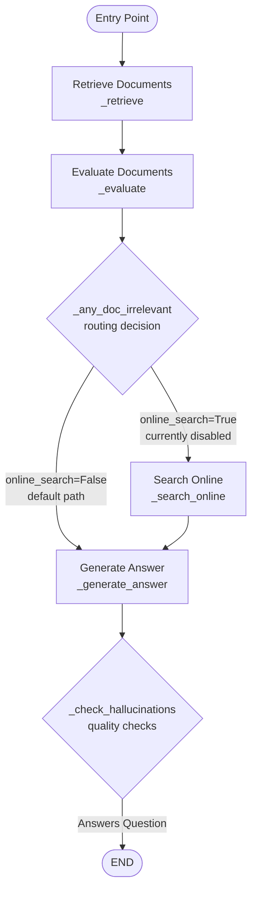

# FinDocs RAG

Retrieval-augmented Q&A for financial documents, built with Streamlit, LangGraph, Chroma, and OpenAI. Upload annual reports, CFO commentaries, fund documents, or spreadsheets, and ask targeted questions. Answers are grounded in your documents with inline [n] citations to the exact sources.


## What’s Included

- Multi-file, multi-format ingestion (PDF, DOCX, CSV, XLSX, TXT, MD, source files)
- Chunking via tiktoken-aware splitter and OpenAI embeddings to Chroma vector store
- LangGraph-orchestrated workflow for retrieval, grading, generation, and checks
- Inline source citations [n] and source panel with filename/page/chunk
- Lightweight built-in evaluation on a small finance dataset (NVDA, JPM)


## How It Works

High-level flow orchestrated by LangGraph:

1) Retrieve Documents → 2) Evaluate Documents → 3) Generate Answer → 4) Check Hallucinations → END

- Retrieval: Uses a session-scoped Chroma collection with OpenAI embeddings
- Grading: Filters to relevant chunks before generation
- Generation: Produces answers with [n] citations that map to the retrieved chunks
- Checks: Performs document- and question-relevance checks as reference signals

### LangGraph StateGraph Structure

The RAG workflow is implemented as a LangGraph state machine with conditional routing:



**Node Functions:**
- **Retrieve Documents**: Vector similarity search against Chroma DB to find relevant document chunks
- **Evaluate Documents**: LLM-based evaluation of each retrieved document's relevance to the query
- **Generate Answer**: Creates a comprehensive answer with inline `[n]` citations referencing specific chunks
- **Search Online**: Tavily web search fallback (currently disabled in config, node kept for extensibility)
- **Check Hallucinations**: Two-layer validation ensuring answer is grounded in documents and addresses the question

**Routing Logic:**
- `_any_doc_irrelevant`: Currently hardcoded to always route to "Generate Answer" (online search disabled)
- `_check_hallucinations`: Validates answer quality through document relevance and question relevance checks

**Note:** The "Search Online" node (shown with dashed border) is part of the graph structure but not executed in the current configuration (`ENABLE_ONLINE_SEARCH = False`).


## Features

- Supported types: pdf, docx/doc, csv, xlsx/xls, txt, md, py, js, html, xml
- Per-session vector store isolation (each Streamlit session uses a unique collection)
- Inline [n] citations with a Sources panel that shows filename and page/chunk
- Simple metrics block for document evaluation results on each answer
- Optional LangSmith tracing if enabled via environment


## Evaluation (Built-in)

The app includes a lightweight evaluation harness and a small finance dataset:
- PDFs: `evaluation/docs/NVDA-Q4FY25-CFO-Commentary.pdf`, `evaluation/docs/chase-report.pdf`
- Questions: `evaluation/test_cases.json` (5 cases with acceptable variants)
- Metrics shown in UI: Normalized EM and Hit@1 (doc-level)

How to run:
- Open the app and click Run Evaluation in the sidebar. The app will lazily build a dedicated eval index (separate from your session’s index), run the test set, and render summary and per-case details.

## Testing

This repository is thoroughly tested with both unit and integration tests that cover the full RAG pipeline. Running `./scripts/run_tests.sh` will execute the entire test suite and generate a `coverage.xml` report, demonstrating the current level of test coverage (98.03% line coverage and 96.43% branch coverage as of the latest run).

1. Create/activate the virtualenv and install test dependencies:
   ```bash
   python -m venv .venv
   . .venv/bin/activate
   pip install -r requirements-dev.txt
   ```
2. Run the full unit + integration suite (fastest loop):
   ```bash
   pytest
   ```
3. Generate statement & branch coverage plus HTML/XML artefacts:
   ```bash
   ./scripts/run_tests.sh
   ```
   The script wipes old data (`coverage erase`), runs `coverage run -m pytest`, and writes:
   - `coverage.xml` (machine-readable summary for CI/badges)
   - `htmlcov/index.html` (viewable coverage per file; because `.coveragerc` sets `skip_covered = True`, the HTML report only shows files that are not yet 100%)
   - Console summary via `coverage report -m`


## Setup

Requirements
- Python 3.11+
- An OpenAI API key for embeddings and chat models

Install
```bash
pip install -r requirements.txt
```

Environment
Create a `.env` in the project root with at least:
```env
OPENAI_API_KEY=your_openai_api_key
```

Run
```bash
streamlit run app.py
```
The app starts at http://localhost:8501


## Usage

1) Upload your finance documents (multi-file supported)
2) Ask a question in the Query section
3) Read the answer and check inline citations [n]
4) Expand Sources to inspect the cited chunks
5) Optionally run the Evaluation view from the sidebar

Notes
- On first load, the app clears the session’s Chroma data to start clean
- Each browser session gets its own Chroma collection; re-uploads update the collection incrementally


## Architecture Details

- UI: Streamlit layout, sidebar navigation, multi-file uploader
- Ingestion: Multi-format loader with temporary files for uploads
- Chunking: `CharacterTextSplitter.from_tiktoken_encoder` with `CHUNK_SIZE=1000` and `CHUNK_OVERLAP=100`
- Embeddings/Vector store: OpenAIEmbeddings + Chroma (persisted under `./.chroma`)
- Orchestration: LangGraph state machine with nodes for retrieve/grade/generate/check
- Generation: ChatOpenAI with a prompt that enforces [n] citations
- Evaluation chains: document and question relevance


## Project Structure

```
./
├─ app.py                 # Streamlit app entry
├─ config.py              # UI and RAG settings
├─ utils.py               # Session and DB utilities
├─ ui_components.py       # Sidebar, upload, query components
├─ document_loader.py     # Streamlit-friendly loader wrapper
├─ multimodal_loader.py   # Multi-format file loader
├─ document_processor.py  # Chunking + Chroma indexing
├─ rag_workflow.py        # LangGraph workflow
├─ chains/
│  ├─ generate_answer.py  # RAG prompt with [n] citations
│  ├─ evaluate.py         # Document sufficiency evaluator
│  ├─ document_relevance.py
│  └─ question_relevance.py
├─ evaluation/
│  ├─ docs/*.pdf          # Small finance dataset (demo)
│  └─ test_cases.json     # 5 test cases
└─ state.py               # Graph state definition
```
